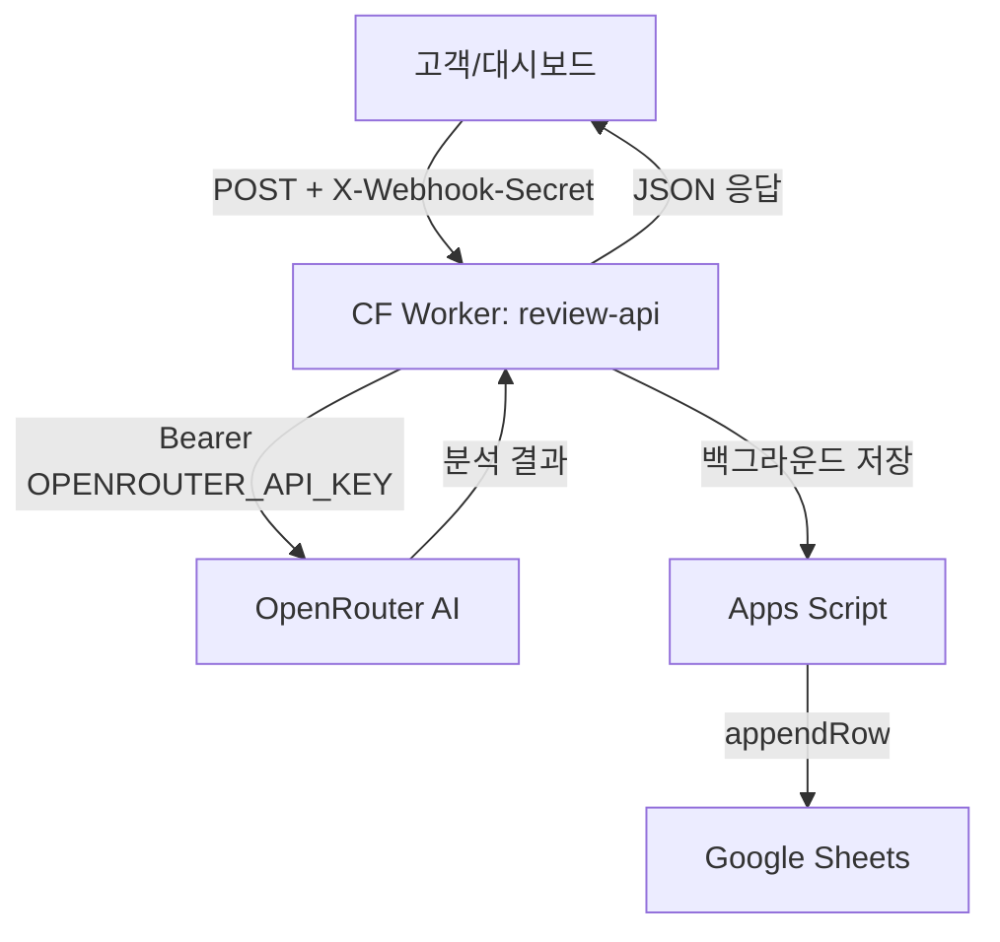

# LoopForge AI 프로젝트 — 옵시디언 노트

## 🗂️ 프로젝트 개요

> 소상공인의 반복 업무를 AI로 자동화하고, 검증된 워크플로우를 Micro-SaaS로 제품화하는 1인 AI 자동화 기업

### 핵심 문장
**"서비스로 검증하고, 자동화로 운영하고, SaaS로 제품화하고, 템플릿으로 글로벌 판매한다."**

---

## 🏗️ 현재 인프라

### 배포된 서비스

| 서비스 | URL | 역할 |
|---|---|---|
| 랜딩페이지 | https://loopforge-2v1.pages.dev | 영업용 |
| 리뷰 API | https://loopforge-review-api.wnsrua01.workers.dev | AI 분석 |
| 웹훅 프록시 | https://loopforge-webhook-proxy.wnsrua01.workers.dev | n8n 보안 |
| 카카오 채널 | http://pf.kakao.com/_wLasX | 고객 문의 |

---

## 📋 오늘 완료한 작업 (2026-05-17)

### ✅ 완료
- [x] Cloudflare Worker `loopforge-review-api` 배포
- [x] OpenRouter API 연동 (Llama 3.3 70B)
- [x] Google Sheets 자동 저장 연동
- [x] Cloudflare Pages 랜딩페이지 배포
- [x] Webhook Proxy Worker 배포
- [x] 카카오 비즈채널 생성 (loopforgeai)
- [x] 샘플 리포트 카드 3종 제작
- [x] 업종별 영업 DM 문구 5종 작성

### ⏳ 진행 중
- [ ] Railway n8n 설치
- [ ] 영업 타깃 리스트 20곳
- [ ] 카카오 알림톡 템플릿 심사

---

## 💰 수익 목표

| 기간 | 목표 | 금액 |
|---|---|---|
| 30일 | 첫 고객 3명 | 147만 원 |
| 60일 | 유지관리 MRR | 90만 원/월 |
| 90일 | SaaS 런칭 | 월 4.9만 원 구독 |

---

## 🔑 환경변수 (보안)

> ⚠️ 실제 값은 Cloudflare Dashboard에서 관리

| Worker | 변수명 | 상태 |
|---|---|---|
| review-api | OPENROUTER_API_KEY | ✅ |
| review-api | WEBHOOK_SECRET | ✅ (lf2026) |
| webhook-proxy | WEBHOOK_SECRET | ✅ (lf2026) |
| webhook-proxy | N8N_WEBHOOK_URL | ⏳ n8n 설치 후 |

---

## 🔗 관련 노트 및 시스템 연결

### 📂 로컬 시스템 문서 연계
- **[[LoopForge_종합인덱스_및_교차검증]] ([종합 인덱스](./LoopForge_종합인덱스_및_교차검증.md))** - 🌟 전체 문서의 마스터 맵 및 교차검증 보고서
- **[[LoopForge_Wiki]] ([프로젝트 위키](./LoopForge_Wiki.md))** - 세부 기술 스택, API 명세, Sheets 구조
- **[[LoopForge_헤르메스_엔지니어링]] ([엔지니어링 문서](./LoopForge_헤르메스_엔지니어링.md))** - 아키텍처, 코드 구조, n8n 설정 및 배포 정보
- **[[LoopForge_헤르메스_에이전트_컨텍스트]] ([에이전트 컨텍스트](./LoopForge_헤르메스_에이전트_컨텍스트.md))** - Claude 컨텍스트 즉시 복원용 핵심 요약

### 📝 기타 작업 노트
- [[LoopForge_n8n_워크플로우]]
- [[LoopForge_영업전략]]
- [[LoopForge_기술스택]]
- [[LoopForge_고객리스트]]

---

## 📅 다음 세션 할 일

1. Railway 접속 → n8n 템플릿 배포
2. n8n에 `loopforge-review-workflow.json` import
3. Webhook Proxy N8N_WEBHOOK_URL 업데이트
4. 인스타 해시태그로 영업 타깃 20곳 수집
5. DM 발송 시작
