# LoopForge AI — 종합 인덱스 및 교차검증 보고서

> 🌟 **LoopForge AI 프로젝트의 마스터 인덱스 맵이자 4대 주요 시스템 문서의 정합성 교차검증 리포트입니다.**
> 이 문서는 옵시디언(Obsidian), 프로젝트 위키(Wiki), 엔지니어링 문서, 에이전트(Hermes) 컨텍스트 간의 유기적 연결을 지도화하고 데이터 정합성을 증명합니다.

---

## 🗺️ 시스템 문서 연계 지도 (Document Map)

네 개의 핵심 문서는 서로를 긴밀히 상호 참조(Cross-linking)하고 있습니다. 아래 링크를 통해 각 문서로 즉시 이동할 수 있습니다.

```mermaid
graph TD
  Master["🌟 종합 인덱스 & 교차검증<br>(LoopForge_종합인덱스_및_교차검증.md)"]
  Obsidian["🗂️ 옵시디언 노트<br>(LoopForge_Obsidian.md)"]
  Wiki["📖 프로젝트 위키<br>(LoopForge_Wiki.md)"]
  Eng["🏗️ 엔지니어링 문서<br>(LoopForge_헤르메스_엔지니어링.md)"]
  Agent["🤖 에이전트 컨텍스트<br>(LoopForge_헤르메스_에이전트_컨텍스트.md)"]

  Master --> Obsidian
  Master --> Wiki
  Master --> Eng
  Master --> Agent

  Obsidian <--> Wiki
  Wiki <--> Eng
  Eng <--> Agent
  Agent <--> Obsidian

  Obsidian <--> Eng
  Wiki <--> Agent
  
  style Master fill:#1a3a2a,stroke:#00E5A0,stroke-width:2px;
  style Obsidian fill:#2a2a2a,stroke:#888,stroke-width:1px;
  style Wiki fill:#2a2a2a,stroke:#888,stroke-width:1px;
  style Eng fill:#111,stroke:#0066FF,stroke-width:1px;
  style Agent fill:#111,stroke:#9900FF,stroke-width:1px;
```

### 🔗 바로가기 링크 리스트 (옵시디언 / 로컬 마크다운 더블 지원)
1. **[[LoopForge_Obsidian]] ([옵시디언 노트](./LoopForge_Obsidian.md))**
   - *목적:* 1인 기업 관점에서의 프로젝트 개요, Mermaid 개념 아키텍처, 30-60-90일 목표, 환경 변수 보안 현황, 당일 작업 기록 및 할 일 리스트 관리.
2. **[[LoopForge_Wiki]] ([프로젝트 위키](./LoopForge_Wiki.md))**
   - *목적:* 전체 기술 스택, Cloudflare 인프라 설정 정보, 상세 API Request/Response 명세서, 구글 시트 테이블 컬럼 정의서, 비즈니스 요금제 설계 및 문제 트러블슈팅 아카이브.
3. **[[LoopForge_헤르메스_엔지니어링]] ([엔지니어링 문서](./LoopForge_헤르메스_엔지니어링.md))**
   - *목적:* 구체적인 시스템 아키텍처, Workers의 BATCH(5개씩) 처리 로직, System Prompt 가이드라인, Google Apps Script 실제 JavaScript 소스 코드, n8n Railway 배포 가이드, curl 테스트 명령어 모음.
4. **[[LoopForge_헤르메스_에이전트_컨텍스트]] ([에이전트 컨텍스트](./LoopForge_헤르메스_에이전트_컨텍스트.md))**
   - *목적:* 새로운 세션이나 대화 창을 열었을 때 AI 에이전트(Claude 등)에게 즉시 입력하여 프로젝트 컨텍스트를 100% 복원(Restore)하기 위한 액션 오리엔티드 매뉴얼.

---

## 🔎 시스템 교차검증 (Cross-Validation)

각 문서에서 선언하고 사용하고 있는 모든 주요 인프라 주소, 변수명, 비즈니스 지표들을 대조하여 불일치(Inconsistency)가 없는지 검증했습니다. **검증 결과 100% 완벽한 데이터 정합성**이 확인되었습니다.

### 1. 인프라 URL & ID 정합성 검증

모든 문서가 하나의 중앙 집중식 Cloudflare 및 Google 인프라 자산을 일관되게 가리키고 있습니다.

| 대상 항목 | 할당된 값 | 검증 대상 문서 | 정합성 결과 |
| :--- | :--- | :--- | :---: |
| **Cloudflare Account ID** | `fc803653c06c6fcb04a44fc1412abdd5` | Wiki, Agent Context | **일치 (Pass)** |
| **Workers 하위 도메인** | `wnsrua01.workers.dev` | Obsidian, Wiki, Eng, Agent | **일치 (Pass)** |
| **Review API Endpoint** | `https://loopforge-review-api.wnsrua01.workers.dev` | Obsidian, Wiki, Eng, Agent | **일치 (Pass)** |
| **Webhook Proxy Endpoint** | `https://loopforge-webhook-proxy.wnsrua01.workers.dev` | Obsidian, Wiki, Eng, Agent | **일치 (Pass)** |
| **Landing Pages URL** | `https://loopforge-2v1.pages.dev` | Obsidian, Wiki, Agent, HTML | **일치 (Pass)** |
| **Google Spreadsheet ID** | `1E4UpklUu1r2QhyV1KXc8eq_ZhQ0XMoAYZD0EZNbmSn8` | Wiki, Agent Context | **일치 (Pass)** |
| **Apps Script WebApp URL** | `https://script.google.com/macros/s/AKfycbwRHTxA4dqpz...` | Wiki, Agent Context | **일치 (Pass)** |
| **Kakao 채널 URL** | `http://pf.kakao.com/_wLasX` | Obsidian, Wiki, Agent, HTML | **일치 (Pass)** |

---

### 2. 보안 인증 및 환경변수 정합성 검증

보안이 핵심인 웹훅 및 외부 API 토큰 구조에 대한 일관성 검증 결과입니다.

- **`WEBHOOK_SECRET`**:
  - *검증 결과:* 모든 Workers(Review API, Webhook Proxy)와 n8n 및 에이전트 문서 전체에서 일관되게 **`lf2026`** 값으로 일치합니다.
  - *이력:* 기존에 발생했던 '인증 실패(헤더값 잘림)' 오류를 교훈 삼아, 안전하고 직관적인 `lf2026` 단축값으로 통일하여 구축되었습니다.
- **`OPENROUTER_API_KEY`**:
  - *검증 결과:* Groq 403 오류 차단 문제를 극복하기 위해 `OpenRouter API (Llama 3.3 70B)`로 완전히 통일되었으며, 모든 환경변수 문서 및 엔지니어링 소스 코드 주석에 `sk-or-v1-...` 사양이 균일하게 반영되어 있습니다.
- **`N8N_WEBHOOK_URL`**:
  - *검증 결과:* 현재 Railway n8n 인프라가 배포 준비 단계(`⏳ 설치 진행 중`)이므로, `webhook-proxy` 및 `Agent Context` 등 모든 문서에서 `N8N_WEBHOOK_URL`이 동일하게 미설정(`⏳ 대기 상태`)으로 정의되어 있어 혼선이 방지되어 있습니다.

---

### 3. 요금 및 비즈니스 매트릭스 정합성 검증

영업 프라이싱 테이블과 1인 기업의 비즈니스 수익 목표(수학적 정합성)를 상호 검증한 결과입니다.

- **요금제 테이블 (Wiki, Agent Context)**:
  - **무료 진단**: 0원 (10분 무료 진단 컨설팅)
  - **테스트 패키지 (세팅)**: **49만 원** (1회성 구축 및 집중 셋업)
  - **스탠다드 요금**: **99만 원** (답글+CS+블로그+리포팅+n8n 통합팩 구축)
  - **월 유지관리**: **30만 원~** (MRR)
  - **SaaS 구독 요금**: **월 4.9만 원** (예정)
- **Obsidian 노트의 수학적 수익 목표 정합성**:
  - **30일 목표 (첫 고객 3명)**: **147만 원**
    - 💡 *수학적 검증:* `테스트 패키지 49만 원 × 3명 = 147만 원`으로 요금제 테이블과 정확히 계산이 맞아떨어집니다.
  - **60일 목표 (유지관리 MRR)**: **90만 원/월**
    - 💡 *수학적 검증:* `기본 유지관리 30만 원 × 3명 = 90만 원`으로 요금제 테이블 기준과 수학적 정합성이 일치합니다.
- **HTML(랜딩페이지) 가격 카드 일관성**:
  - 랜딩페이지 `index.html` 상의 결제/신청 카드가 '리포트팩 문의하기' 및 '자동화 세팅 신청(49만 원 사양)'으로 일원화되어, 구축형 서비스 전략과 완벽히 궤를 같이하고 있습니다.

---

### 4. API 스키마 & 데이터 레이아웃 정합성 검증

`LoopForge_Wiki`에 정의된 API 스키마와 `LoopForge_헤르메스_엔지니어링`에 기술된 실제 JavaScript 백엔드 구동 구조의 데이터 형태를 대조 검증했습니다.

- **리뷰 분석 응답 JSON 객체 데이터 맵핑**:
  - **`sentiment_score`**: 1~5점 점수 (Workers LLM Prompt, Wiki 스키마, Google Apps Script 컬럼 매칭 완료)
  - **`sentiment_label`**: `positive`, `negative`, `neutral` (Workers prompt와 Wiki API 사양 상호 일치)
  - **`keywords`**: Array 형식을 Apps Script 단에서 `.join(', ')` 형태로 시트에 안전하게 파싱하여 평면 텍스트로 보존하게끔 상호 설계됨.
  - **`personal_thanks` / `cs_defense`**:
    - 긍정 리뷰(`sentiment_label == positive`)일 때 `personal_thanks`에 답글을 생성하고 `cs_defense`는 `null`이 됩니다.
    - 부정 리뷰(`sentiment_label == negative`)일 때 `cs_defense`에 대응 문구를 작성하고 `personal_thanks`는 `null`이 됩니다.
    - 이 로직은 LLM System Prompt 지시문 및 Google Sheets 분기 저장 스크립트(`positive_reviews` 시트와 `negative_reviews` 시트로의 분기 `appendRow` 처리) 구조와 정확하게 1:1 대응하여 실시간 작동합니다.

---

## 🛠️ 향후 시스템 동기화 가이드 (Hermes & Architect Guide)

1. **상태 업데이트 규칙**:
   - `n8n` 인프라가 Railway에 설치되어 배포가 완료되는 즉시, `WEBHOOK_URL` 정보를 다음 세 문서에 동시 갱신해야 합니다:
     1. `LoopForge_Obsidian.md` (환경변수 테이블 및 할 일 체크)
     2. `LoopForge_Wiki.md` (3. 배포 인프라 및 8. n8n 섹션)
     3. `LoopForge_헤르메스_에이전트_컨텍스트.md` (인프라 현황 테이블 및 다음 할 일)
2. **코드 변경 시 전파**:
   - Cloudflare Workers(`review-api` 등)의 핵심 스크림트 로직이나 `System Prompt`가 변경될 경우, `LoopForge_헤르메스_엔지니어링.md` 및 `LoopForge_Wiki.md` 두 곳에 코드 조각과 프롬프트 지침을 동시 업데이트하여 문서 최신성을 보존하십시오.
3. **영업 정책 변경 시**:
   - 단가 또는 비즈니스 가격 정책이 조정될 경우, `Obsidian` 목표 산출액, `Wiki` 요금 테이블, `Agent Context` 요금 정보, 그리고 `index.html` 내 가격 카드 요소를 연쇄적으로 동시 수정하십시오.
